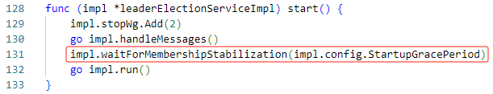
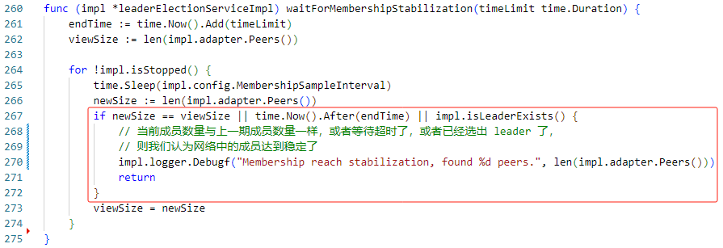
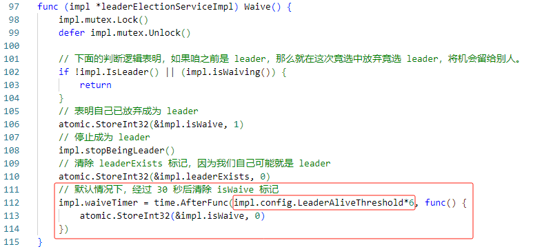

# Leader election

## 1. 配置时间参数

每个 `election` 服务都采用以下参数进行时间同步配置：

```go
type ElectionConfig struct {
	// 默认 15 秒
	StartupGracePeriod time.Duration
	// 默认 1 秒
	MembershipSampleInterval time.Duration
	// 默认 10 秒
	LeaderAliveThreshold time.Duration
	// 默认 5 秒
	LeaderElectionDuration time.Duration
}
```

- **StartupGracePeriod:** 开启 `election` 服务时，会等待 `StartupGracePeriod` 这么长的时间，目的是等到网络中成员数量趋于稳定。


    `waitForMembershipStabilization` 方法的定义如下所示：

    

    可以看到，`election` 服务根据 `StartupGracePeriod` 设置一个超时时间，然后在超时到来前，每隔 `MembershipSampleInterval` 这么长时间检查一下网络中成员数量是否达到稳定，或者网络中已经有 `leader` 被选出，如果前面两个情况发生其一，则认为网络达到稳定。

- **MembershipSampleInterval:** 开启 `election` 服务时，会每隔 `MembershipSampleInterval` 这么长时间检查一下网络中成员数量是否达到稳定，或者网络中已经有 `leader` 被选出，如果前面两个情况发生其一，则认为网络达到稳定。

- **LeaderAliveThreshold:** 它具有如下作用：
    - 已经有 `leader` 存在，且我不是 `leader` 的情况下，那么就等待 `LeaderAliveThreshold` 这么长的时间，然后重新选举 `leader`。
    - 已经有 `leader` 存在，且我就是 `leader` 的情况下，那么就广播我是 `leader` 的声明，并等待 `1/2 * LeaderAliveThreshold` 这么长的时间，收集网络中其他节点的 `declaration` 或者 `proposal`。`declaration` 是某个节点声明自己是 `leader` 的消息。`proposal` 是某个节点产生的消息，里面仅包含该节点的 `id`，这个消息绝不是节点用来声明自己是 `leader` 的。
    - 当节点放弃竞选 `leader` 后，它会进入一个超时等待时间，一旦等待超时，那么此节点又会加入竞选 `leader` 的行列，这个超时时间就是 `6 * LeaderAliveThreshold`。

    

- **LeaderElectionDuration:** 当节点开始选举 `leader` 时，它会等待 `LeaderElectionDuration` 定义的超时时间，在这段时间内，它会一直收集其他节点的 `proposal`，但是如果它在这段超时时间内收集到了其他节点的 `declaration` 消息，就会立马退出等待超时的状态，并且我们会直接认为网络中已选举出 `leader`，然后停止竞选 `leader` 的过程。

## 2. 选举规则

在网络中没有 `leader` 时，由 `id` 值最小的节点担任 `leader`。